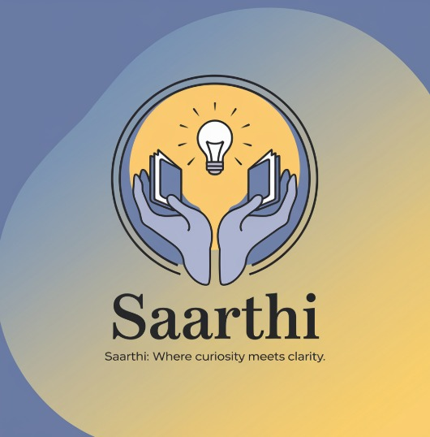

# Saarthi
## Saarthi - Empowering Careers with Clarity

**Saarthi** is an AI-powered platform designed to help students like Vivek bridge the gap between their current skills and career aspirations. By delivering personalized learning paths, actionable feedback, and tailored course recommendations, Saarthi ensures that every learner can identify, develop, and enhance the skills necessary for employability in a rapidly evolving job market. With its user-centric design, Saarthi transforms uncertainty into opportunity, guiding learners toward meaningful career outcomes.

---
### **Project Overview**

#### **Empowering Every Learner: Bridging Skill Gaps with Innovation**
In today’s competitive job market, many students, especially from underserved regions, face significant challenges due to **limited career guidance**, **unclear pathways**, and **a lack of targeted skill-building opportunities**. **Saarthi** addresses these gaps by offering a comprehensive, **AI-driven platform** designed to assess, guide, and empower students like Vivek, who aspire to align their skills with market demands but struggle to find the right starting point.

Our platform acts as a **career compass**, providing:
- **Skill assessments** to evaluate current competencies.
- **Personalized learning paths** tailored to individual goals.
- **Targeted course recommendations** aligned with industry trends.
- **Periodic assessments** and **actionable feedback** to ensure measurable progress.

By harnessing the power of AI, **Saarthi** empowers students to take charge of their learning journey, ensuring they are equipped to meet their career aspirations with confidence.

---
### **Inspiration**
The inspiration behind Saarthi stems from the challenges faced by students like Vivek, who, despite their determination to succeed, often lack the resources, guidance, and clarity needed to navigate the complexities of career development. These barriers can leave students feeling unprepared and disconnected from emerging job opportunities.

**Our vision** is to create a **platform** that serves as a personalized career guide, helping students:
- Identify their strengths and areas for improvement.
- Discover relevant skills and courses aligned with their aspirations.
- Build confidence and competence through targeted interventions.

By providing tailored guidance and actionable insights, Saarthi aims to transform uncertainty into opportunity, empowering students to unlock their full potential.

---
### **Key Features of the Platform**

1. **AI-Powered Skill Assessment**
   - Evaluate existing skills and identify areas for improvement through interactive assessments.
   - Provide a detailed skills profile to help students understand their strengths and gaps.

2. **Personalized Learning Paths**
   - Tailored recommendations based on individual goals, aspirations, and market trends.
   - Dynamic learning paths that adapt to student progress and evolving career objectives.

3. **Targeted Course Recommendations**
   - Suggest specific courses, workshops, and certifications aligned with in-demand skills.
   - Highlight affordable or free resources to ensure accessibility for all learners.

4. **Actionable Feedback and Interventions**
   - Provide periodic assessments to track progress and offer actionable insights.
   - Deliver targeted skill-building activities and nudges to keep learners on track.

5. **Progress Tracker**
   - Visualize learning milestones and skill development over time.
   - Celebrate achievements to motivate continued growth.

6. **Career Guidance and Mentorship**
   - Access to expert mentors and career advisors for personalized support.
   - Peer-led discussion forums to foster collaboration and shared learning.

7. **Accessible and Inclusive Design**
   - User-friendly interface optimized for students from diverse backgrounds.
   - Multilingual support to ensure inclusivity for non-English speakers.

8. **Affordable and Scalable Solutions**
   - Minimal-cost access to premium features, ensuring affordability.
   - Scalable infrastructure to reach underserved regions effectively.

---
### **Technologies & Tools Used**

- **Frontend**: CSS, JavaScript, ejs  
- **Backend**: NodeJS, ExpressJS, MongoDB Atlas, Flask API  
- **AI Tools**: Plotch.ai, Groclake, Gemini API  
- **Framework**: Bootstrap  
- **Cloud Services**: Cloudinary  
- **Deployment**: Render  
- **Other Tools**: Python  

---
### **Challenges We Faced**

1. **Dynamic Skill Assessment Algorithm**
   - Designing an algorithm to evaluate diverse skill sets and provide personalized recommendations required extensive research and testing.

2. **Seamless Integration of AI Tools**
   - Ensuring smooth communication between Plotch.ai, Groclake, and other AI tools with our platform demanded meticulous API development and testing.

3. **Balancing Accessibility and Advanced Features**
   - Developing a feature-rich platform while maintaining affordability and ease of use for underserved students posed a significant challenge.

Despite these hurdles, our team’s dedication and innovative problem-solving ensured the delivery of a robust and impactful solution.

---
### **Revenue Model**

#### **Sustainable Revenue with Accessibility at Its Core**

1. **Affordable Subscription Plans**
   - Low-cost subscription tiers offering access to advanced features and premium content.

2. **Collaborations with Governments and NGOs**
   - Partnering with organizations to provide free or subsidized access for underserved communities.

3. **Micro-Certifications**
   - Offering affordable certifications to validate skills and enhance employability.

4. **Affiliate Partnerships**
   - Recommending career resources and tools through affiliate programs to generate revenue while adding value for users.

5. **Voluntary Donations**
   - Encouraging contributions from alumni and organizations to support free access for students in need.

---
### **What’s Next: Future Directions**

#### 🌍 **AI-Driven Career Roadmaps**
- **Skill Gap Analysis:** Identify gaps between current skills and desired roles.
- **Tailored Career Recommendations:** Suggest specific roles and industries based on student profiles.
- **Job Market Insights:** Provide real-time data on emerging trends and opportunities.

#### 🤝 **Mentorship Ecosystem**
- **Expert-Led Webinars:** Access industry insights from professionals.
- **Peer Study Groups:** Foster collaboration and shared learning.
- **Mentorship Circles:** Connect with domain experts for personalized guidance.

#### 🌟 **Holistic Development Opportunities**
- **Innovation Challenges:** Promote creativity and problem-solving.
- **Leadership Workshops:** Build essential career skills.
- **Project-Based Learning:** Offer hands-on experience to strengthen technical expertise.

These initiatives reflect our commitment to creating a platform that not only addresses immediate learning needs but also prepares students for long-term success in their chosen careers.

